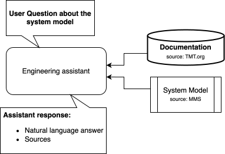
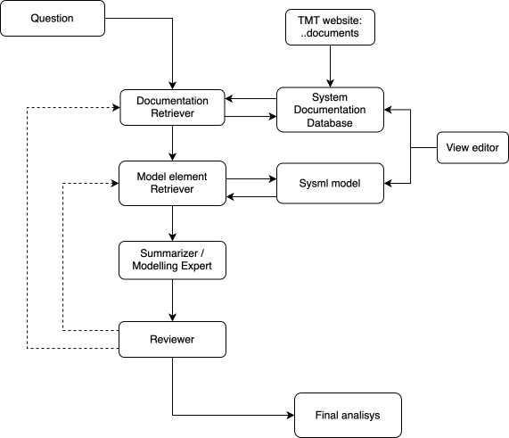
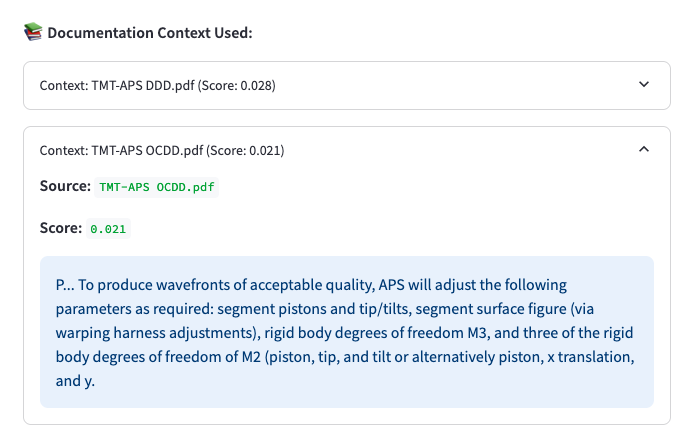

# TMT Chatbot

An interactive chatbot designed to assist with the Thirty Meter Telescope (TMT) system engineering documents and models.

## Architecture and Workflow

### Architecture Overview

The assistant connects user questions with TMT documentation and the system model to produce answers with sources.



### Chatbot Workflow

The workflow shows documentation and model retrieval, summarization, review, and the final analysis.



### Documentation Context in the Frontend

The frontend displays retrieved documentation, source files, relevance scores, and supporting excerpts.



## 🚀 Quick Start

### 1. Clone the Repository

```bash
git clone https://github.com/ernyei13/TMT_chatbot_new.git
cd TMT_chatbot_new
```

### 2. Create and Activate Virtual Environment

```bash
python -m venv venv
source venv/bin/activate      # On Windows use: venv\Scripts\activate
```

### 3. Install Dependencies

```bash
pip install --upgrade pip
pip install -r requirements.txt
```

### 4. Launch the Streamlit App

```bash
streamlit run frontend/main_fe.py
```

After running the command, your browser will open the Streamlit app.


## 📝 Notes

- Python 3.9 or higher is recommended.
- Make sure your `.env` file is set up if using any environment-specific variables.
```
